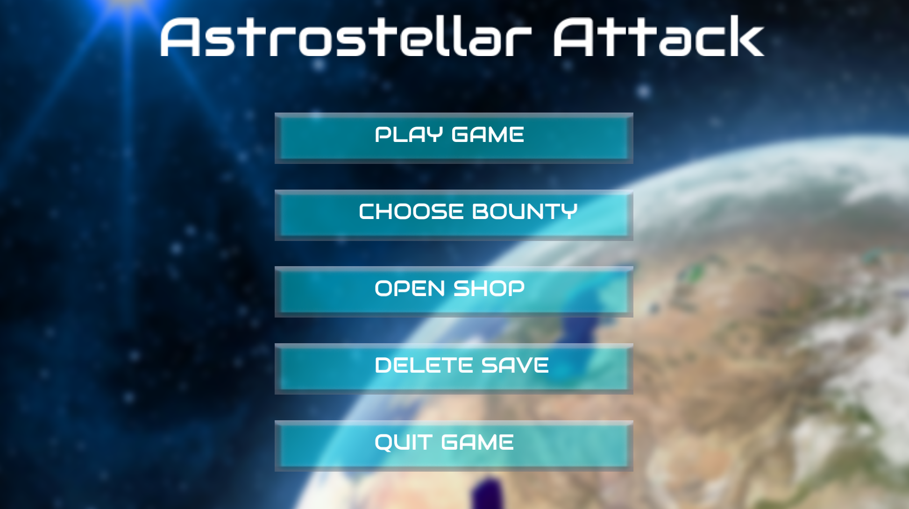
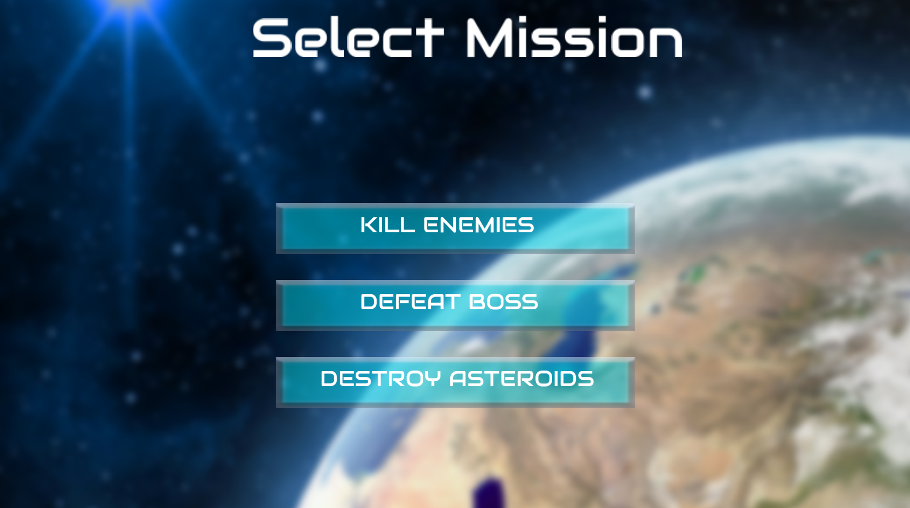
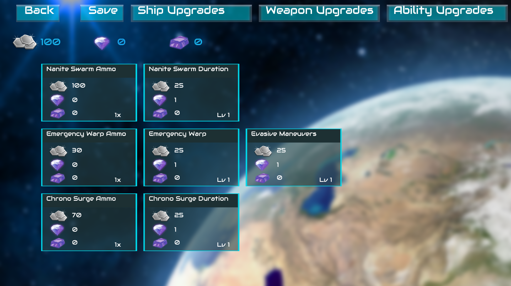
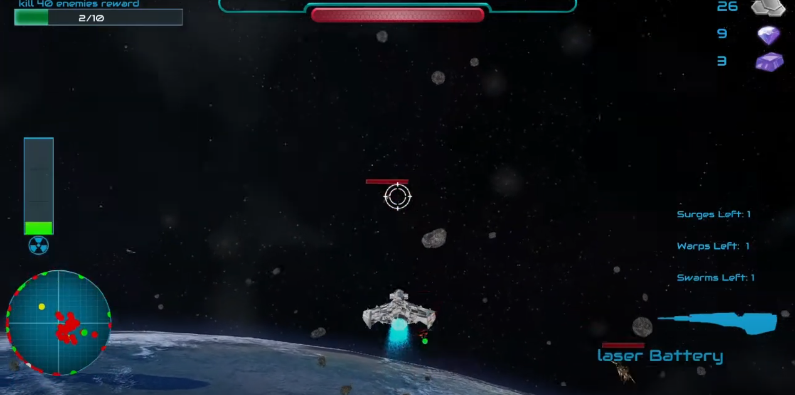

Authors: SHARJEEL ALI, DAVID NEUDORF

## Overview

Astrostellar Attack is a 3D first person/third person spaceship shooter developed in C++ for a group project for the course COMP-3501 at Carleton University.
The aim of the game is to complete three different objectives, each containing their own unique gameplay elements, and in the process, also upgrading your ship to have more weapons, health, etc.

# Table of Contents
1. [Gameplay Demo](#gameplay-demo)
2. [Installation](#installation)
3. [Libraries](#libraries)
4. [Code Structure](#code-structure)
5. [Documentation](#documentation)
6. [Make your life easy](#make-your-life-easy)
7. [screenshots](#screenshots)

## Gameplay Demo

https://youtu.be/gBNgNmY3Q50

## Installation

To build, simply run cmake using the cmakelists.txt file, and maks sure to set the correct libraries in the cmake folder.

To also add, you will require changing 3 paths defined in the path_config header file located in include/setup/path_config.h

Once the game is running, it takes 40 seconds to load everything, so just wait.

## Libraries

The codebase uses two libraries, being the freetype library for text rendering as well as nlohmann json for json reading and writing. These are both included in the libraries/ folder, so there should hopefully be no need for extra downloads.

## Code structure

As seen, the code is organized into various sections. This is mainly described in the writeup report, but for the most important parts, such as shaders, keep this in mind:
resource/shader: stores the object shaders
resource/screen: stores screen space effects
resource/particle: stores particle effects

## Documentation

Everything aside from the files found in the /setup have been commented (the /setup includes the resource classes, which werent really modified at all). Each function is commented in the header file, while only important or complex things are commented in the source file to make things easier.

Whenever an external source was used, it is also commented (Source: Link), or listed in the `/sources.txt` file.

## Make your life easy

In order to make testing around with features easier, you can modify the save file located in saves/game_state.json. DO NOT MODIFY THE _DEFAULT.JSON FILE AT ALL COSTS. This file stores all of the save data such as player inventory, etc. so if you want to buy everything to test it, change the values here.

Another thing to test, is the bounties. Go into src/world/game.cpp and around 650 there will be the following code:
"else if (btn.compare("startButton")==0) {"
In here, you should see a "num" attribute that is being assigned using if statements to compare bounty string values. Change the number to something small such as 5 for the asteroid or enemies if statements. This means instead of destroying 60 or 40 enemies/asteroids, you only need to destroy 5.

## Screenshots

Main Menu

Level Menu

Shop Menu

Gameplay
